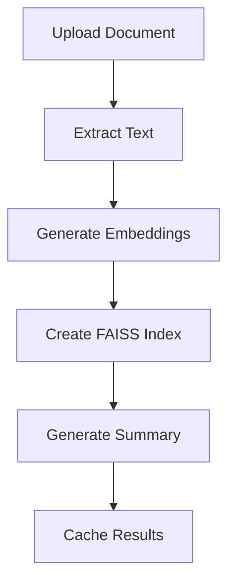
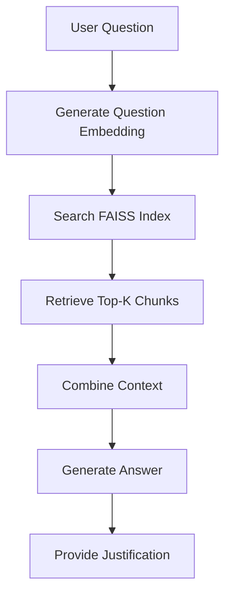
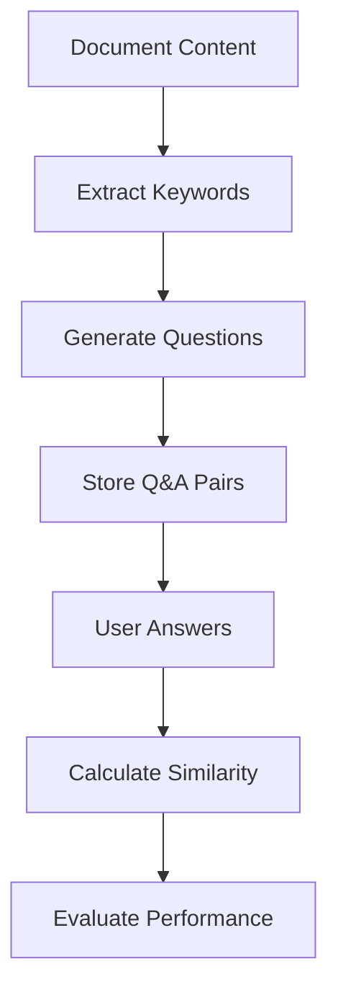

# 📊 Professional Document Assistant

## 🌟 Introduction

The **Professional Document Assistant** is an advanced AI-powered platform that revolutionizes document analysis and knowledge assessment. Built with cutting-edge machine learning technologies, this application enables users to upload documents, ask intelligent questions, and test their comprehension through AI-generated assessments.

### ✨ Key Features

- **🤖 Intelligent Document Analysis**: Upload PDF or TXT files for comprehensive AI analysis
- **❓ Smart Q&A System**: Ask detailed questions and receive contextual answers with source references
- **🎯 Knowledge Assessment**: Auto-generated quiz questions based on document content
- **⚡ Performance Optimization**: Advanced caching system for faster response times
- **🎨 Professional UI**: Clean, business-oriented interface built with Streamlit
- **📊 Real-time Analytics**: Track session statistics and performance metrics

---

## 📋 Table of Contents

1. [Introduction](#-introduction)
2. [Architecture Overview](#-architecture-overview)
3. [Project Structure](#-project-structure)
4. [Setup Instructions](#-setup-instructions)
5. [Usage Guide](#-usage-guide)
6. [API Endpoints](#-api-endpoints)
7. [Technology Stack](#-technology-stack)
8. [Reasoning Flow](#-reasoning-flow)
9. [Performance Optimization](#-performance-optimization)
10. [Contributing](#-contributing)
11. [License](#-license)

---

## 🏗️ Architecture Overview

The application follows a **microservices architecture** with clear separation of concerns:

```
┌─────────────────┐    ┌─────────────────┐    ┌─────────────────┐
│   Frontend      │────│   Backend API   │────│  AI Processing  │
│   (Streamlit)   │    │   (FastAPI)     │    │   (Transformers)│
└─────────────────┘    └─────────────────┘    └─────────────────┘
        │                       │                       │
        │                       │                       │
        ▼                       ▼                       ▼
┌─────────────────┐    ┌─────────────────┐    ┌─────────────────┐
│  User Interface │    │  Caching Layer  │    │  Model Storage  │
│   Components    │    │   (In-Memory)   │    │   (Hugging Face)│
└─────────────────┘    └─────────────────┘    └─────────────────┘
```

### 🔧 Core Components

1. **Frontend Layer** (`app.py`): Streamlit-based user interface
2. **API Layer** (`main.py`): FastAPI backend with RESTful endpoints
3. **Processing Modules**:
   - `upload.py`: Document processing and summarization
   - `askanything.py`: Q&A system with semantic search
   - `challenge.py`: Question generation and evaluation
4. **State Management** (`state.py`): Global state handling
5. **Caching System**: In-memory caching for performance optimization

---

## 📁 Project Structure

```
GenAI/
├── Backend/
│   ├── app.py                 # Streamlit frontend application
│   ├── main.py                # FastAPI backend with caching
│   ├── upload.py              # Document upload and summarization
│   ├── askanything.py         # Q&A processing with FAISS
│   ├── challenge.py           # Question generation and evaluation
│   ├── state.py               # Global state management
│   ├── run.py                 # Application runner
│   ├── uploads/               # Document storage directory
│   └── __pycache__/          # Python cache files
├── env/                       # Virtual environment
└── README.md                  # Project documentation
```

---

## 🚀 Setup Instructions

### Prerequisites

- **Python 3.8+**
- **pip** package manager
- **Virtual environment** (recommended)

### 1. Clone the Repository

```bash
git clone <repository-url>
cd GenAI
```

### 2. Create Virtual Environment

```bash
# Windows
python -m venv env
env\Scripts\activate

# macOS/Linux
python3 -m venv env
source env/bin/activate
```

### 3. Install Dependencies

```bash
pip install -r requirements.txt
```

**Required packages:**
```
streamlit==1.28.1
fastapi==0.104.1
uvicorn==0.24.0
transformers==4.35.0
sentence-transformers==2.2.2
faiss-cpu==1.7.4
pdfminer.six==20221105
keybert==0.8.1
torch==2.1.0
numpy==1.24.3
requests==2.31.0
python-multipart==0.0.6
```

### 4. Create Requirements File

```bash
pip freeze > requirements.txt
```

### 5. Start the Application

#### Option A: Using the Runner Script
```bash
cd Backend
python run.py
```

#### Option B: Manual Startup

**Terminal 1 - Backend API:**
```bash
cd Backend
uvicorn main:app --reload --host 0.0.0.0 --port 8000
```

**Terminal 2 - Frontend:**
```bash
cd Backend
streamlit run app.py --server.port 8501
```

### 6. Access the Application

- **Frontend**: http://localhost:8501
- **Backend API**: http://localhost:8000
- **API Documentation**: http://localhost:8000/docs

---

## 📖 Usage Guide

### Step 1: Document Upload
1. Navigate to the upload section
2. Select a PDF or TXT file (max recommended size: 10MB)
3. Wait for processing and AI summary generation

### Step 2: Ask Questions
1. Enter detailed questions about your document
2. Receive AI-powered answers with source references
3. View justifications and context information

### Step 3: Knowledge Assessment
1. Generate AI-created questions based on document content
2. Answer the questions in the provided text areas
3. Submit for automatic evaluation and scoring

### Step 4: Review Results
1. Check your accuracy percentage and performance rating
2. Review detailed explanations for each question
3. Learn from AI-provided justifications

---

## 🔗 API Endpoints

### Document Management
- `POST /upload/` - Upload and process documents
- `GET /upload/` - Generate document summary

### Question & Answer
- `POST /askanything/` - Submit questions for AI analysis

### Knowledge Assessment
- `GET /challenge/` - Generate assessment questions
- `POST /challenge/` - Evaluate user responses

### API Documentation
Visit `http://localhost:8000/docs` for interactive API documentation.

---

## 🛠️ Technology Stack

### Backend Technologies
- **FastAPI**: High-performance web framework
- **Python 3.8+**: Core programming language
- **Uvicorn**: ASGI server for FastAPI

### AI/ML Technologies
- **Transformers**: Hugging Face model library
- **Sentence Transformers**: Semantic text embeddings
- **FAISS**: Efficient similarity search and clustering
- **T5**: Text-to-text transfer transformer
- **DistilBERT**: Efficient question-answering model
- **KeyBERT**: Keyword extraction library

### Frontend Technologies
- **Streamlit**: Interactive web application framework
- **HTML/CSS**: Custom styling and components

### Data Processing
- **PDFMiner**: PDF text extraction
- **NumPy**: Numerical computing
- **Python Standard Library**: File handling and utilities

---

## 🧠 Reasoning Flow

### 1. Document Processing Flow



### 2. Question-Answer Flow



### 3. Assessment Flow



### Detailed Reasoning Process

#### Document Analysis
1. **Text Extraction**: PDF/TXT files are processed to extract clean text
2. **Chunking**: Documents are split into structured paragraphs with section headers
3. **Embedding Generation**: Each chunk is converted to high-dimensional vectors
4. **Indexing**: FAISS creates an efficient search index for similarity matching

#### Question Processing
1. **Query Understanding**: User questions are embedded using the same model
2. **Semantic Search**: FAISS finds the most relevant document chunks
3. **Context Assembly**: Top-K chunks are combined for comprehensive context
4. **Answer Generation**: DistilBERT generates precise answers from context
5. **Source Attribution**: Responses include section references and justifications

#### Assessment Generation
1. **Keyword Extraction**: KeyBERT identifies important concepts
2. **Question Synthesis**: T5 model generates diverse question types
3. **Answer Validation**: Expected answers are extracted from source content
4. **Similarity Scoring**: User responses are evaluated using cosine similarity

---

## ⚡ Performance Optimization

### Caching Strategy
- **File-level Caching**: Documents cached by MD5 hash
- **Question-level Caching**: Q&A pairs cached by content hash
- **Model Caching**: AI models loaded once at startup
- **Embedding Caching**: Vector representations stored per document

### Memory Management
- **Cache Size Limits**: Configurable maximum cache entries
- **Automatic Cleanup**: Periodic cache pruning
- **Efficient Storage**: Optimized data structures

### Response Time Optimization
- **Model Pre-loading**: All AI models initialized at startup
- **Batch Processing**: Efficient handling of multiple operations
- **Asynchronous Operations**: Non-blocking I/O operations

---

## 🤝 Contributing

### Development Guidelines
1. **Code Style**: Follow PEP 8 standards
2. **Documentation**: Add docstrings for all functions
3. **Testing**: Write unit tests for new features
4. **Error Handling**: Implement comprehensive exception handling

### Contribution Steps
1. Fork the repository
2. Create a feature branch
3. Make your changes
4. Add tests and documentation
5. Submit a pull request

---

## 📄 License

This project is licensed under the MIT License - see the [LICENSE](LICENSE) file for details.

---

## 🆘 Support

For questions, issues, or feature requests:

1. **GitHub Issues**: Report bugs and request features
2. **Documentation**: Check this README and API docs
3. **Community**: Join our discussions

---

## 🙏 Acknowledgments

- **Hugging Face**: For providing excellent pre-trained models
- **Streamlit**: For the intuitive web framework
- **FastAPI**: For the high-performance backend framework
- **FAISS**: For efficient similarity search capabilities

---

*Built with ❤️ for intelligent document analysis*
